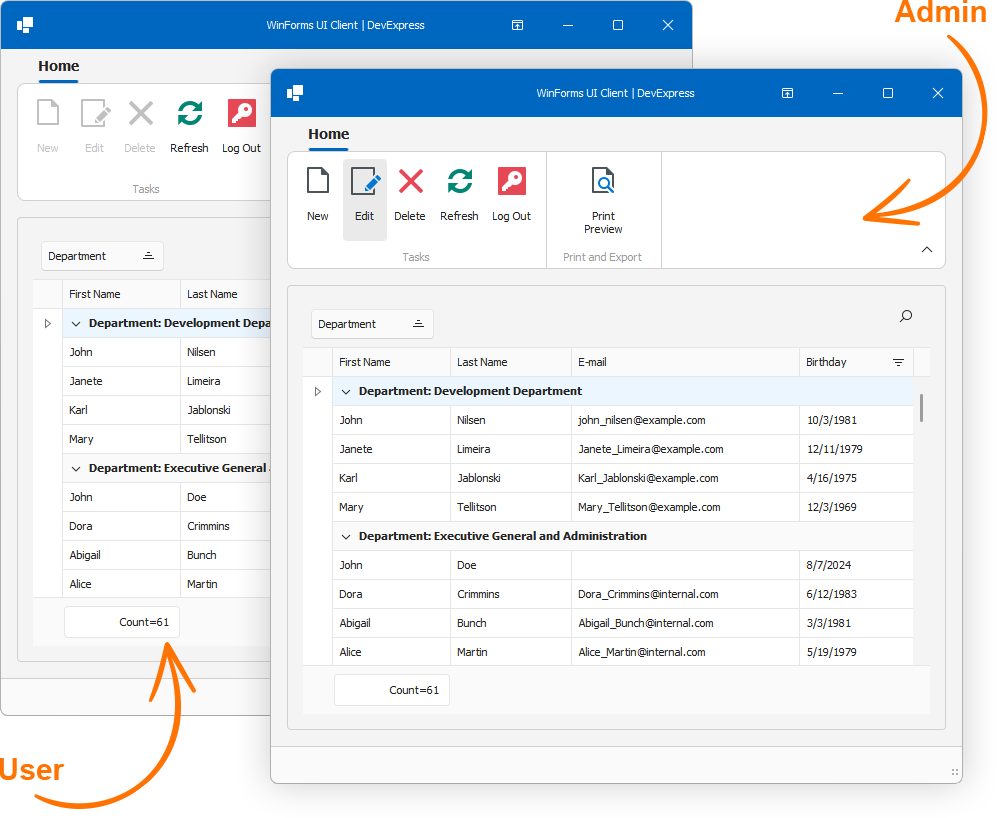

<!-- default badges list -->

[](https://supportcenter.devexpress.com/ticket/details/T1249896)
[](https://docs.devexpress.com/GeneralInformation/403183)
[](#does-this-example-address-your-development-requirementsobjectives)
<!-- default badges end -->

# Connect the DevExpress WinForms Data Grid to a Backend using a Middle Tier Server (EF Core without OData)

This example uses the [Middle Tier Server](https://docs.devexpress.com/eXpressAppFramework/404398/data-security-and-safety/security-system/security-tiers/middle-tier-security-ef-core/connect-to-the-efcore-middle-tier-service-from-non-xaf-applications) that ships as part of the [DevExpress XAF (Cross-Platform .NET App UI)](https://www.devexpress.com/products/net/application_framework/) to securely communicate with a backend. By using a middle tire server, you can reduce security-related risks associated with direct database connections. When a middle tier is used, desktop UI clients cannot access database connection information or modify database tables directly (middleware can prevent SQL injection and other database-related threat vectors).

EF Core developers can retain their standard DbContext and initiate remote and secure connections to a database from a .NET client. Our Middle Tier solution "replaces" direct database connections with middleware. Once implemented only authorized users can access specific/sensitive data or perform specific actions. This implementation also helps reduce code duplication, as the same logic can be reused by multiple clients.

The example in this repository demonstrates the following:

1. How to build a data model for application business entities and security policies with EF Core.
2. How to use the DevExpress ASP.ENT Core Middle Tier Security Server to connect a Windows Forms .NET 8 client application to a backend.
3. How to define access permissions and activate authentication/authorization for a .NET 8 WinForms app.
4. How to create a login form.
5. How to customize UI/UX for a given user based on associated access permissions.
6. How to create an edit form to modify and save data (CRUD).

## Prerequisites

* [Visual Studio 2022 v17.0+](https://visualstudio.microsoft.com/vs/)
* [.NET SDK 8.0+](https://dotnet.microsoft.com/en-us/download/dotnet)
* [Download and run our Unified Component Installer](https://www.devexpress.com/products/try/) or [add NuGet feed URL to Visual Studio](https://docs.devexpress.com/GeneralInformation/116042/installation/install-devexpress-controls-using-nuget-packages/obtain-your-nuget-feed-url) NuGet feeds.

> We recommend that you select all products when you run the DevExpress installer. Doing so will register local NuGet package sources and item/project templates. You can uninstall unnecessary components at a later time.

## Getting Started

1. Open *MiddleTierExample.sln*. [Register a DevExpress NuGet feed](https://docs.devexpress.com/GeneralInformation/116698/nuget/setup-visual-studios-nuget-package-manager) in the Visual Studio IDE. Skip this step if you have already registered your DevExpress NuGet feed.
2. Restore NuGet packages in the solution.
3. Run the *MiddleTier.Server* project. Right-click MiddleTier.Server in the Solution Explorer and select **Debug** | **Start New Instance** in the menu. Your default web browser will open. Starting the server for the first time can take up to 20 seconds.

    **Note**: Do not close the web browser.
4. Run the *WinForms.Client* project. Right-click WinForms.Client in the Solution Explorer and select **Debug** | **Start New Instance** in the menu.
5. Click "Log in" to proceed. The password for Admin and User accounts is an empty string. You can sort, filter, and group grid rows (records) as needed. Double-click a grid row to open the edit form and modify cell values.



## Implementation Details

### Initialization and Authentication

The `RemoteContextUtils` class implements utility APIs related to remote `DbContext` and secured communication within client applications.

The `CreateSecuredClient` method securely connects to an EF Core Middle Tier Security application:

```csharp
public static WebApiSecuredDataServerClient CreateSecuredClient(string url, string login, string password) {
    var httpClient = new HttpClient();
    httpClient.BaseAddress = new Uri(url);
    httpClient.DefaultRequestHeaders.Add("Accept", "application/json");
    var securedClient = new WebSocketSecuredDataServerClient(httpClient, XafTypesInfo.Instance);
    securedClient.CustomAuthenticate += (sender, arguments) => {
        arguments.Handled = true;
        HttpResponseMessage msg = arguments.HttpClient.PostAsJsonAsync("api/Authentication/Authenticate", (AuthenticationStandardLogonParameters)arguments.LogonParameters).GetAwaiter().GetResult();
        string token = (string)msg.Content.ReadFromJsonAsync(typeof(string)).GetAwaiter().GetResult();
        if(msg.StatusCode == HttpStatusCode.Unauthorized) {
            throw new UserFriendlyException(token);
        }
        msg.EnsureSuccessStatusCode();
        arguments.HttpClient.DefaultRequestHeaders.Authorization
            = new AuthenticationHeaderValue("bearer", token);
    };
    securedClient.Authenticate(new AuthenticationStandardLogonParameters(login, password));
    ((IMiddleTierServerSecurity)securedClient).Logon();
    return securedClient;
}
```

The `RemoteContextUtils.GetDBContext()` method returns a secured DbContext for CRUD operations:

```csharp
public static DXApplication1EFCoreDbContext GetDBContext() {
    return new DXApplication1EFCoreDbContext(Options);
}
public static DbContextOptions<DXApplication1EFCoreDbContext> CreateDbContextOptions(WebApiSecuredDataServerClient securedClient) {
    var builder = new DbContextOptionsBuilder<DXApplication1EFCoreDbContext>();
    return builder
        .UseLazyLoadingProxies()
        .UseChangeTrackingProxies()
        .UseMiddleTier(securedClient)
        .Options as DbContextOptions<DXApplication1EFCoreDbContext>;
}
```

### Access Permissions

This example creates **Admin** and **User** roles and defines the following permissions:

* **Admin**: Read/Write (full access)
* **User** Read Only (data editing is not permitted)

```csharp
public class Updater : ModuleUpdater {
    private const string AdministratorUserName = "Admin";
    private const string AdministratorRoleName = "Administrators";
    private const string DefaultUserName = "User";
    private const string DefaultUserRoleName = "Users";
	//...
    private PermissionPolicyRole GetUserRole() {
        PermissionPolicyRole userRole = ObjectSpace.FirstOrDefault<PermissionPolicyRole>(u => u.Name == DefaultUserRoleName);
        if(userRole == null) {
            userRole = ObjectSpace.CreateObject<PermissionPolicyRole>();
            userRole.Name = DefaultUserRoleName;
            userRole.AddTypePermission<Employee>(SecurityOperations.Read, SecurityPermissionState.Allow);
            userRole.AddTypePermission<Employee>(SecurityOperations.Write, SecurityPermissionState.Deny);
        }
        return userRole;
    }
	//...
}
```

### Login Form: Validate User Credentials, User Authorization

LoginForm contains `userNameEdit` and `passwordEdit` text editors for user credentials. The "Log In" button attempts to log the user into the security system and returns `DialogResult.OK` if a login was successful:

```csharp
namespace WinForms.Client {
    internal static class Program {
        [STAThread]
        static void Main() {
     //…
            while(!RemoteContextUtils.IsLogin)
                using(AuthForm authForm = new AuthForm()) {
                    if(authForm.ShowDialog() == DialogResult.OK) {
                        MiddleTierStartupHelper.WaitMiddleTierServerReady(MiddleTierStartupHelper.EFCoreWebApiMiddleTierInstanceKey, TimeSpan.MaxValue);
                        // User authorization.
                        var securedClient = RemoteContextUtils.CreateSecuredClient(System.Configuration.ConfigurationManager.AppSettings["endpointUrl"], authForm.Login, authForm.Password);
                        RemoteContextUtils.SecuredDataServerClient = securedClient;
                        DbContextOptions<DXApplication1EFCoreDbContext> options = RemoteContextUtils.CreateDbContextOptions(securedClient);
                        RemoteContextUtils.Options = options;

                        Application.Run(new MainForm());
                    }
                    else
                        break;
                }

        }
    }
}
```

### Desktop UI Client: Bind the DevExpress Data Grid to Remote Data

The `SetUpBinding` method creates a DbContext, uses it as a queryable data source for the server mode source (`EntityServerModeSource`), and binds the grid to the server mode source.

```csharp
namespace WinForms.Client {
    public partial class MainForm : RibbonForm {
        EntityServerModeSource serverModeSource = new EntityServerModeSource();
        DXApplication1EFCoreDbContext dbContext = null;
        public MainForm() {
            InitializeComponent();
            SetUpBinding();
        }
        void SetUpBinding() {
            dbContext?.Dispose();
            dbContext = RemoteContextUtils.GetDBContext();
            serverModeSource = new EntityServerModeSource() { ElementType = typeof(Employee), KeyExpression = "ID" };
            serverModeSource.QueryableSource = dbContext.Employees;
            gridControl.DataSource = serverModeSource;
        }
    }
}
```

### Configure UI Based on Access Permissions

Highlighted code snippets enable/disable Ribbon commands (New, Edit, Delete) based on access permissions for the current (logged in) user:

```csharp
public MainForm() {
    InitializeComponent();
    SetUpBinding();

    bbiNew.Enabled = RemoteContextUtils.IsGranded(typeof(Employee), SecurityOperations.Create);
    bbiDelete.Enabled = RemoteContextUtils.IsGranded(typeof(Employee), SecurityOperations.Delete);
    bbiEdit.Enabled = RemoteContextUtils.IsGranded(typeof(Employee), SecurityOperations.Write);
}
```

## See Also

* [Middle Tier Security with EF Core](https://docs.devexpress.com/eXpressAppFramework/404389/data-security-and-safety/security-system/security-tiers/middle-tier-security-ef-core)
* [Create a WinForms Application (.NET) with EF Core Middle Tier Security](https://docs.devexpress.com/eXpressAppFramework/404390/data-security-and-safety/security-system/security-tiers/middle-tier-security-ef-core/create-winforms-application-with-middle-tier-security)
* [WinForms — Connect a .NET Desktop Client to a Secure Backend Web API Service (EF Core with OData)](https://community.devexpress.com/blogs/winforms/archive/2024/07/18/winforms-connect-a-net-desktop-client-to-a-secure-backend-with-the-devexpress-web-api-service-ef-core-with-odata.aspx)

<!-- feedback -->
## Does this example address your development requirements/objectives?

[](https://www.devexpress.com/support/examples/survey.xml?utm_source=github&utm_campaign=connect-winforms-grid-to-backend-using-middletier-server&~~~was_helpful=yes) [](https://www.devexpress.com/support/examples/survey.xml?utm_source=github&utm_campaign=connect-winforms-grid-to-backend-using-middletier-server&~~~was_helpful=no)

(you will be redirected to DevExpress.com to submit your response)
<!-- feedback end -->
